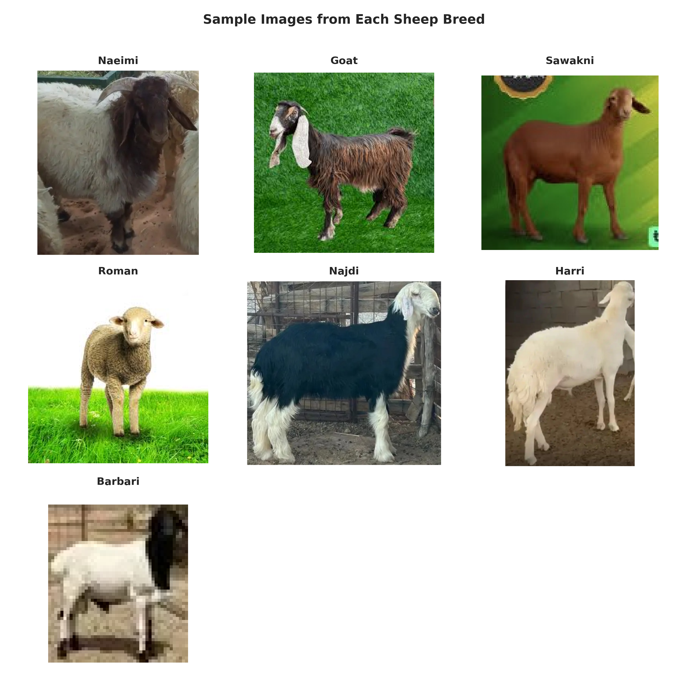
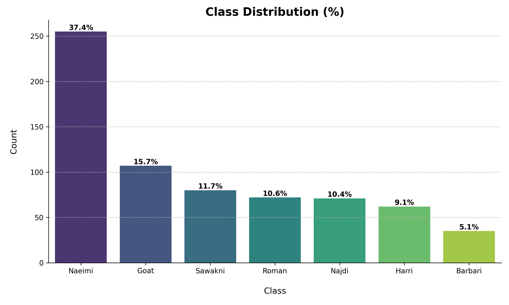
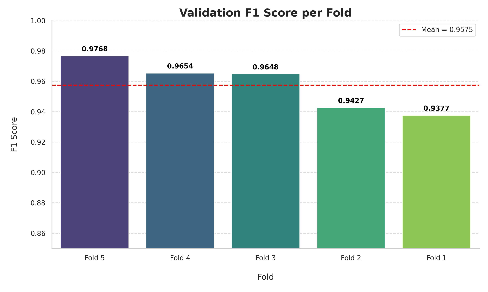
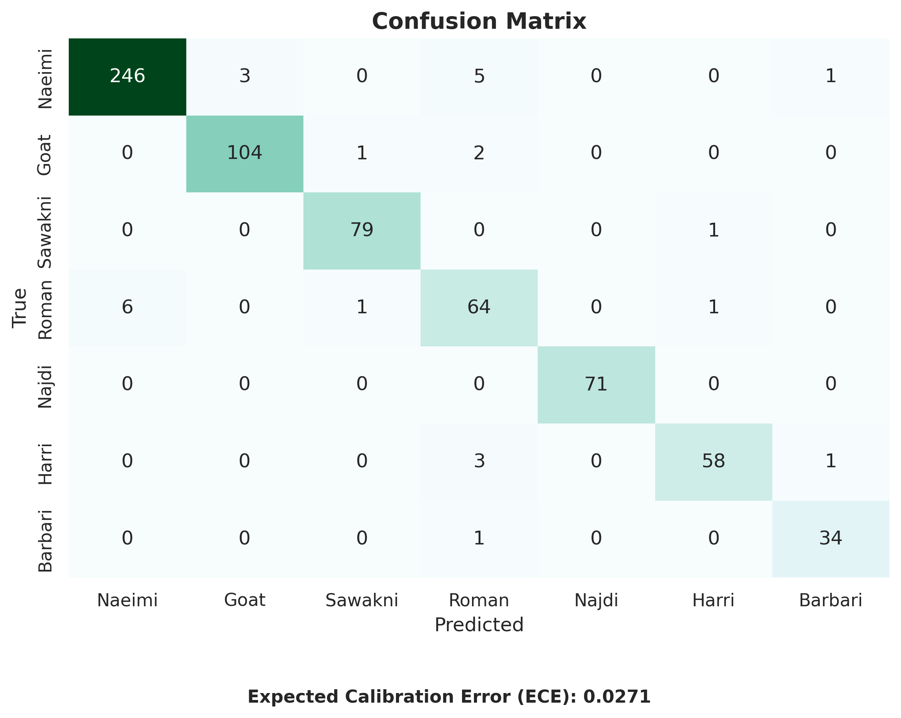

# Sheep Breed Classification – DAAL 2025 Challenge

This project was developed for the **Eid Al-Adha 2025: Sheep Classification Challenge**, hosted on **Kaggle** by **DAL**.  
The goal is to classify sheep images into **7 distinct breeds** using a deep learning pipeline with **EfficientNetV2-S**.

---

## Highlights

- **Model**: EfficientNetV2-S (pretrained on ImageNet)
- **Cross-Validation**: 5-Fold Stratified
- **Loss Function**: Class-Weighted CrossEntropy
- **Inference**: Weighted Softmax Ensembling (based on F1)
- **Validation Accuracy**: `96.00%`
- **Macro F1 Score**: `0.9605`
- **Expected Calibration Error (ECE)**: `0.0271`
- **Private Leaderboard Score**: `0.96516`

---

## Technical Overview

| Component         | Details                                                      |
|------------------|--------------------------------------------------------------|
| **Architecture** | Fine-tuned EfficientNetV2-S                                  |
| **Augmentations**| Resize, RandomCrop, HorizontalFlip, ColorJitter, Erasing     |
| **Regularization** | EarlyStopping, ReduceLROnPlateau                         |
| **Metrics**      | F1 (macro), Confusion Matrix, Classification Report          |
| **Calibration**  | Expected Calibration Error (ECE)                             |
| **Ensembling**   | Weighted Softmax across folds                                |

---

## Target Classes

- Naeimi
- Goat
- Sawakni
- Roman
- Najdi
- Harri
- Barbari

---

## Visualizations

### 🔹 Sample Images


### 🔹 Class Distribution


### 🔹 F1 Score per Fold


### 🔹 Confusion Matrix


---

## Project Structure

```
sheep_classification/
│
├── sheep_classifier.ipynb   # Main notebook for training & inference
├── sheep_classifier.py      # Python script version
├── images/                  # Visualizations (plots, confusion matrix, etc.)
├── requirements.txt         # Project dependencies
└── README.md                # Project documentation
```

---

## Acknowledgments

- Thanks to **DAL** for organizing the competition.
- Pretrained weights from `torchvision.models`.
- Implemented using **PyTorch**, **NumPy**, **Seaborn**, and **scikit-learn**.

---
